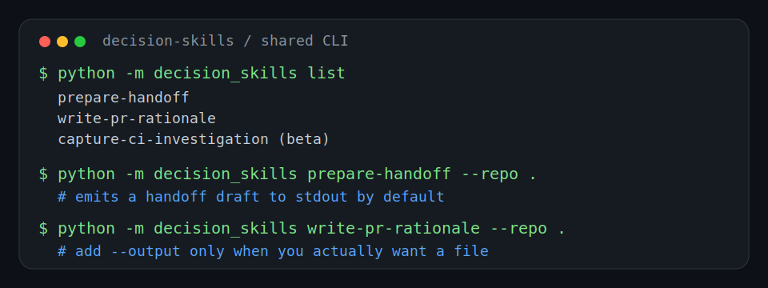
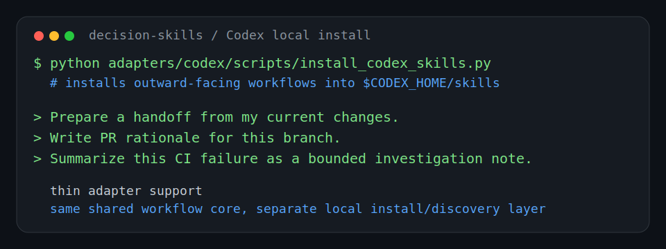

[English](quick-start.md) | 한국어

# Quick Start

## 목적

이 문서는 지금 시점에서 `Mimir-Skills`를 가장 짧고 실용적인 경로로 바로 써보는 방법을 정리한다.

에이전트가 로컬 파일을 읽고 shell 명령을 실행할 수 있다면, 이제 primary path는 관련 `SKILL.md`를 직접 읽는 것이다.
아래 명령 경로는 repo 주도 수집, discovery, 또는 compatibility note가 필요할 때 쓰는 optional local helper다.

현재 실용적인 진입 경로는 네 가지다:

1. 로컬 파일을 직접 읽는 에이전트를 위한 `skill-first reading`
2. 프로젝트에 skill을 한 줄로 설치하는 `one-line install`
3. collector, discovery, deprecation-note compatibility path를 위한 `local helpers`
4. Codex 전용 설치가 필요할 때의 `Codex local install` (하위 호환)

이 경로들이 현재 target agent family와 어떻게 연결되는지는 [Agent Support Levels (English)](agent-support-levels.md)를 참고한다.

## Path 1: Skill-First Reading

이제 기본 추천 경로는 이것이다.

에이전트가 저장소 파일을 직접 열고 shell 명령을 실행할 수 있다면 이 경로를 사용한다.

시작점:

- `skills/prepare-handoff/SKILL.md`
- `skills/write-pr-rationale/SKILL.md`
- `skills/capture-ci-investigation/SKILL.md`

그 다음 필요한 reference만 추가로 읽고, 수집이나 검증 도움이 필요할 때만 optional local script를 사용한다.

## Path 2: One-Line Install

프로젝트에 Mimir-Skills workflow를 한 줄로 설치하고 싶을 때 사용한다.

레포 클론 없이 아무 프로젝트 디렉토리에서 실행할 수 있다:

```bash
npx mimir-skills install --target claude
npx mimir-skills install --target codex
npx mimir-skills install --target generic
```

레포를 클론한 경우:

```bash
python -m mimir_skills install --target claude
python -m mimir_skills install --target codex --codex-home ~/.codex
python -m mimir_skills install --target generic --project-dir /path/to/project
```

특정 workflow만 설치:

```bash
npx mimir-skills install --target claude --workflows prepare-handoff write-pr-rationale
```

프로젝트 디렉토리에 `.claude/` 또는 `.codex/`가 있으면 target을 자동 감지한다. 둘 다 있으면 `--target`을 명시해야 한다.

### Target 디렉토리

| Target | 설치 경로 |
|--------|----------|
| `claude` | `<project>/.claude/skills/` |
| `codex` | `$CODEX_HOME/skills/` (또는 `~/.codex/skills/`) |
| `generic` | `<project>/.skills/` |

### 기대할 수 있는 것

- 설치된 skill은 symlink가 아니라 복사본이다
- example과 evaluation 참조는 로컬 `mimir-skills-support/` 디렉토리를 가리키도록 재작성된다
- `--force`로 기존 설치를 교체할 수 있다

## Path 3: Local Helpers

이제 이것은 main product story가 아니라 secondary helper path다.

저장소 루트에서 discovery, 구조화된 context collection, 또는 오래된 helper 기반 흐름에 대한 compatibility note가 필요할 때 사용한다.



### 명령

사용 가능한 shared workflow를 확인:

```bash
python -m mimir_skills list
```

skill-first `prepare-handoff` 경로를 위한 구조화된 handoff context 수집:

```bash
python skills/prepare-handoff/scripts/collect_git_context.py --repo . --output handoff-context.json
```

skill-first `write-pr-rationale` 경로를 위한 구조화된 PR context 수집:

```bash
python skills/write-pr-rationale/scripts/collect_pr_context.py --repo . --output pr-context.json
```

실제로 산출물이 필요할 때만 디스크에 남긴다:

```bash
python skills/prepare-handoff/scripts/collect_git_context.py --repo . --output handoff-context.json
python skills/write-pr-rationale/scripts/collect_pr_context.py --repo . --output pr-context.json
```

### 기대할 수 있는 것

- `prepare-handoff`는 이제 skill-first workflow다. handoff 초안은 `SKILL.md`와 playbook으로 만들고, collector는 구조화된 git context가 먼저 필요할 때만 사용한다.
- `write-pr-rationale`는 이제 skill-first workflow다. rationale 초안은 `SKILL.md`와 playbook으로 만들고, collector는 구조화된 git context가 먼저 필요할 때만 사용한다.
- `python -m mimir_skills prepare-handoff --repo .`는 여전히 존재하지만, 이제 handoff Markdown을 생성하지 않고 deprecation note를 출력한다.
- `python -m mimir_skills write-pr-rationale --repo .`는 여전히 존재하지만, 이제 reviewer-facing Markdown을 생성하지 않고 deprecation note를 출력한다.
- output은 draft이며, 외부 공유 전에는 여전히 human review가 필요하다.

## Path 4: Codex Local Install (하위 호환)

이전 Codex 전용 설치 경로가 필요할 때 사용한다.



### 명령

현재 outward-facing workflow를 기본 Codex home에 설치:

```bash
python -m mimir_skills install
```

주요 direct-use workflow만 설치:

```bash
python -m mimir_skills install --workflows prepare-handoff write-pr-rationale
```

예전 direct script 경로도 명시적으로 원하면 계속 사용할 수 있다:

```bash
python adapters/codex/scripts/install_codex_skills.py
```

그 다음 Codex에게 다음과 같이 직접 workflow 언어로 요청한다:

- `Prepare a handoff from my current changes.`
- `Write PR rationale for this branch.`
- `Summarize this CI failure as a bounded investigation note.`

### 기대할 수 있는 것

- 이것은 hosted registry flow가 아니라 실제 로컬 install path다
- 설치된 wrapper도 저장소 루트에서 쓰는 것과 같은 skill-first workflow package와 local helper runtime을 가리킨다
- 설치된 Codex skill이 꼭 필요한 경우가 아니면, skill-first reading이 여전히 더 낮은 마찰의 기본 경로다

## 어떤 경로를 고를까

다음과 같다면 `skill-first reading`을 고른다:

- 에이전트가 로컬 파일을 직접 읽을 수 있다
- generated helper output보다 skill rule과 playbook이 더 중요하다
- 저장소를 adapter-light하게 유지하고 싶다

다음과 같다면 `one-line install`을 고른다:

- 레포 클론 없이 skill을 로컬에 설치하고 싶다
- Claude Code, Codex 등 로컬 skills 디렉토리를 읽는 에이전트를 사용한다
- 한 줄로 모든 설정을 끝내고 싶다

다음과 같다면 `local helpers`를 고른다:

- 저장소 루트에서 discovery나 수집 경로를 가장 빨리 쓰고 싶다
- skill에서 초안을 만들기 전에 구조화된 context JSON이 필요하다
- 오래된 helper 기반 호출에 대한 compatibility guidance가 필요하다

다음과 같다면 `Codex local install (하위 호환)`을 고른다:

- 이전 Codex 전용 설치 흐름이 필요하다
- 기존 스크립트와의 하위 호환이 필요하다

## 현재 한계

- `capture-ci-investigation`은 여전히 더 좁은 beta wrapper다
- hosted multi-agent install story는 아직 없지만 `npx mimir-skills install`로 아무 디렉토리에서 한줄 설치가 가능하다
- agent family마다 support level이 다르며, 모든 target이 thin adapter를 갖고 있는 것은 아니다
- 더 자세한 동작과 safety constraint는 [Always-Loaded Rules (English)](always-loaded-rules.md), [Workflow Surface (English)](workflow-surface.md), 각 workflow `SKILL.md`에 남아 있다
- helper command는 secondary이며, primary workflow source of truth는 skill과 reference다
